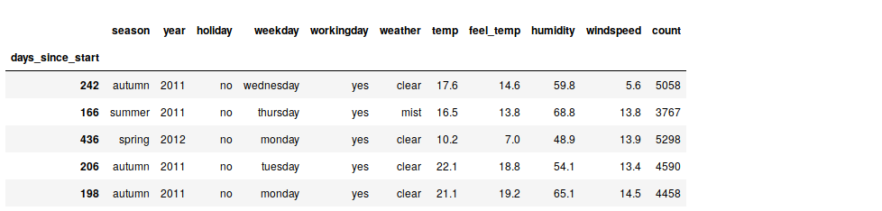
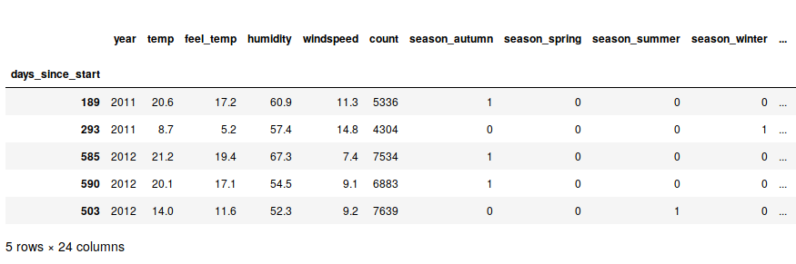
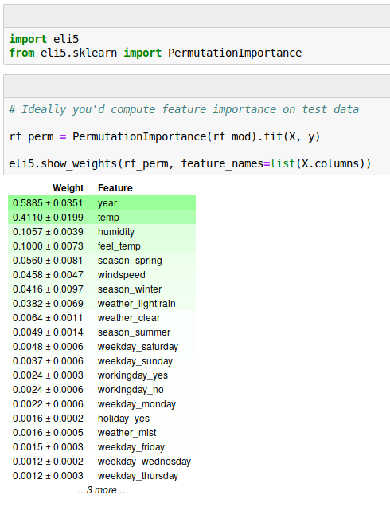
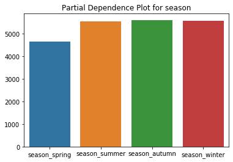
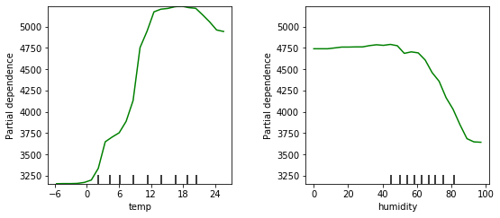
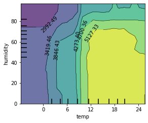
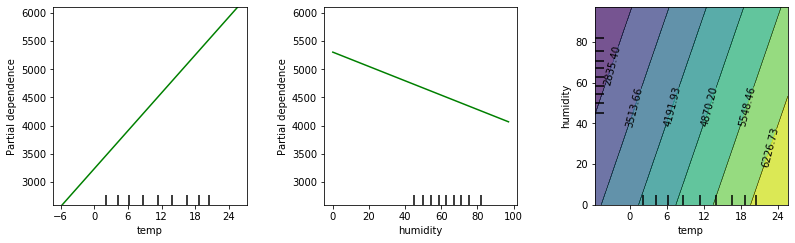

# Interpretable Machine Learning / Explainable Artificial Intelligence

Automatization is a good thing in general. It finishes easy, repetitive tasks, and enables humans to use their time and brain power for newer, more challenging problems. And since machine learning (ML) models automatize decisions, they are a good thing in general, as well.

However, there are a few problems with these models, especially the more complex ones (also called *black-box models*).

## Black-Box Models have Problems

A black-box model, informally, is a model that cannot be understood by looking at its parameters. A linear model is not a black box, but a neural network is - unless you're like Cypher looking at Matrix code.

Three stories shall illustrate the common problems with black-box models.

### 1. Fairness

In October 2018 world headlines reported about [Amazon AI recruiting tool](https://www.theguardian.com/technology/2018/oct/10/amazon-hiring-ai-gender-bias-recruiting-engine) that favored men. Amazon’s model was trained on biased data that were skewed towards male candidates. It has built rules that penalized resumes that included the word “women’s”. ([Source blog post](https://appsilon.com/please-explain-black-box/))

### 2. Understanding

More and more scientific disciplines (like biology) use ML models for producing scientific outcomes. In these cases, we want to use data to extract *scientific knowledge*. We don't care too much about a 98% accurate Random Forest if we can't extract an explanation from the model ([Roscher et al., 2019](https://arxiv.org/pdf/1905.08883.pdf))

### 3. Explainability and Debugging

The EU's GDPR states: "[the data subject should have] the right ... to obtain an explanation of the decision reached". 

One of the consequences of this law is that in February 2019, the Polish government added an amendment to a banking law that says that a bank needs to be able to explain why a loan wasn’t granted if the decision process was automatic.

A similar problem is that an inaccurate model must be *debugged*, e.g. to find out why some data was misclassified. If you know why and where your model fails, you're better equipped for feature engineering, or can better decide to replace a model with a different one.

One good example is from [Ribeiro et al. 2016](https://arxiv.org/pdf/1602.04938.pdf), a classification problem of "Husky or Wolf?", where some Huskys were misclassified. If you look at the pixels that influenced the decision the most, you find that the model has learned to use the snow in the background as a strong indicator for "Wolf":

In this case, you'd have learned that one possible way forward would be to collect more training examples from Huskys in winter.

## Interpretable Machine Learning (IML) to the rescue!

> "Interpretability is the degree to which a human can understand the cause of a decision"
>
> -- Miller, Tim. "Explanation in artificial intelligence: Insights from the social sciences." [arXiv:1706.07269](https://arxiv.org/abs/1706.07269)

The lesson in these three stories is that the recent rise of powerful but complex black-box models introduces the need to be able to look under the hood of machine learning models and *understand* their behavior.

Optimizing a loss function is easy to operationalize, and that's one reason why we frame a ML problem in terms of a loss that we want to minimize. But in reality, we often care about more criteria than just accuracy ([Doshi-Velez et al., 2017](http://arxiv.org/abs/1702.08608)): We want our model to be **fair** and **explainable** - this would also increase social acceptance of our model, and of AI in general. We also care a lot about **safety**. In autonomous driving, we want to be 100% certain that the abstraction for "cyclist" a neural network has learned is correct. Imagine a model would need to "see" two wheels to recognize a bicycle; then, a bicycle with bags over its back wheel would get run over by a car.

The field of Interpretable Machine Learning (IML) is set out to solve these problems. It's a relatively new field, and as such, it changes quickly, new methods emerge at high speed, and the terminology is not yet consistent. You might hear it as *Explainable AI (XAI)*, for example. Some people (like me) use these terms as synonyms, [others](https://towardsdatascience.com/shall-we-build-transparent-models-right-away-196db0eeba6c) make a distinction between them. The lingo is just not consistent yet.

This article is heavily based on Christoph Molnar's book Interpretable Machine Learning, which is available [for free online](https://christophm.github.io/interpretable-ml-book/).

## How to Achieve Interpretability

If you want to understand and explain the behavior of your model, there are two ways to go:

### Option 1: Use interpretable models

The first option is to use simple models that are already interpretable.

One option is a linear regression model. It's always a nice first choice to run, if just as a benchmark. The regression coefficients and their p-values are a nice measure for the size and importance of each feature.

Another candidate, especially for classification, is a short decision tree. They can be visualized in an intuitive way, and most people can use it to make predictions themselves, too.

However, these models have disadvantages. Most importantly, both usually suffer from poor performance in the real world. Linear models are constrained to linear relationships, so they tend to fail whenever the real world contains nonlinear effects (think, for example, of the relationship between your age and your body height). Decision trees, on the other hand, are designed to model step functions, so they fail when the real relationship *is* in fact linear.

These models were popular in the 1980s, where you had small datasets (e.g. in medicine) and cared about simplicity and interpretability. Linear models and decision trees are simple because they come with a set of very restrictive assumptions, which are just not true in the real world. So there has to be a better way to achive interpretability - and luckily, there is.

### Option 2: Use black-box models and post-hoc interpretation methods

A better option is to just go ahead and use your fancy black-box model. Build your neural network, and add a few more layers so marketing can sell it as *our Deep Learning AI™*.

You can start dealing with understanding and explaining your model afterwards, once your model is trained. That's why these methods are called *post-hoc methods*: you apply them *after* your model is trained.

## Interpretation Methods

In this article, I'll introduce three methods for IML. Each method is solving the problems introduced in one of the three stories at the beginning. As always, the answer to "which method" is "it depends". What do you want to understand? The global behavior of your entire model or the factors that influenced a certain prediction? Do you only want to understand the importance of each feature, or also the amount of its contribution? Are there any constraints from the legal department (must all features be explained? is the main target to avoid minority bias?)?

These methods are all *model-agnostic*. This means they are not tied to a certain model type, such as Random Forests. You can *decouple* the model and the interpretation. Model-agnostic methods have a few nice advantages ([Ribeiro et al., 2016](https://arxiv.org/pdf/1606.05386)): 

1. You can completely swap out the model if a different algorithm fits the problem better, and your interpretation methods can just stay in place. 
2. You can use multiple different interpretability methods. The ML engineers in your department might care most about feature importance, while the legal/compliance department cares most about feature effects. And your customers only care about what factors were the most influential for *their personal prediction*.
3. You can even use different features for training and interpreting your model: Train your document classifier with word2vec or any other non-interpretable vector embedding, but interpret it using the actual words again, for example with a simple rule-base algorithm: "If the document contains 'rocket' and 'moon', classify it as aerospace".

The basic idea of all interpretation methods is that you manipulate your input data and measure the changes in the predicted output. For example, take the person whose loan application just got denied, then wiggle on their salary - make it $10,000 larger or smaller - and see what happens to the model's decision.

## Data and Models used

To illustrate the three methods, I will use the [bike sharing dataset](https://archive.ics.uci.edu/ml/datasets/bike+sharing+dataset) from the UCI Machine Learning Repository. It's a widely used sample data set, where you use features like a day's weekday, temperature, humidity, in order to predict how many bikes will be rented on that day.

Here are a few sample rows of the data set. I have preprocessed it slightly and aggregated the numbers from hourly to daily data:

The target column, `count`, is the number of bikes rented on that day. For the model training, we'll transform the categorical features into dummy variables:

As the model, we'll train a simple, untuned Random Forest. Since the methods are model-agnostic, the choice doesn't matter for the sake of this article - we could just as easily use any other algorithm.

The Random Forest has a mean absolute error of around 172. That means that on average, the predicted number of bikes rented is 172 away from the true number.

Let's dive in and look at the following three methods that allow us to understand our black-box model!

- The permutation feature importance (PFI) is a *global* method that explains the *importance* of each feature.
- Partial dependence plots (PDPs) are a *global* method that explains the *effect* of each feature.
- Shapley values are a *local* method that explains the *effect* of each feature, but for a *single* prediction.

### Permutation Feature Importance

In a linear model, the *importance* of a single feature can be measured by the standardized regression coefficient (or the associated p-value). The permutation feature importance (PFI) is a generalized, model-agnostic version of this value.

The PFI was first described in [Leo Breiman's paper on Random Forests](https://www.stat.berkeley.edu/~breiman/randomforest2001.pdf), but it can be used for any other model as well.

The basic algorithm to compute the PFI for one feature (i.e. one column) is this:

1. Shuffle the column of interest
2. Predict the outcome with true data
3. Predict the outcome again with shuffled data
4. Take the difference between the two losses
5. Compute their pointwise average 

Note that no retraining of the model is necessary. This saves a lot of time compared to other methods (like e.g. Shapley Values)

The PFI for one feature automatically captures interaction effects too, because permuting a column also destroys any interaction effects with other features that might have existed.

Let's look at the feature importances of our Random Forest and find out which features are the most important. Python has a package called [eli5](https://pypi.org/project/eli5/) that provides a function for computing the PFIs:

Here, we see that the most important feature is the *year* of the date (in the data used here, only the year-part of the date was recorded). This makes sense because the service was growing rapidly at the time the data was collected, and you'd expect much more service usage in each new year.

The second most important feature is the temperature on that day, and the third most important feature the humidity. This too is in line with what we would expect: More bikes on warmer days, but less bikes again once it gets too hot (a nonlinear relationship again!). Also, more humidity is probably bad for sales - but we'll get to that in the next section on Partial Dependence Plots.

By looking at the PFI of each feature, we have a solution for the first of the three problems mentioned in the beginning of this article, the fairness of an algorithm. Now, we see how much each feature contributes to the predictions, and by this, we can make sure that features such as a person's gender have no big influence on the prediction.

### Partial Dependence Plots

In a linear model, the *effect* of a single feature can be measured by the feature's regression coefficient. The partial dependence plot (PDP) is a generalized, model-agnostic version of this value.

PDPs were first described in [Friedman's paper on Gradient Boosting Machines](https://statweb.stanford.edu/~jhf/ftp/trebst.pdf). It's most intuitive to first understand how a PDP is made for a *categorical* feature. Let's use the `season` in our bike rental data set.

- For each feature value (spring, summer, autumn, or winter):
- Force the entire dataset's `season` to this feature value (e.g. winter)
- Keep all other features (temperature, humidity, etc.) the same
- Predict the number of bikes rented
- Average the predictions

The PDP for the season then looks like this:

We see that we expect to rent out fewer bikes in spring, with all other seasons being roughly equal.

Understand the difference between the PDP of the `season` feature and the mean rented bikes grouped by season: In the PDP, we use *every* instance of the data for computing the "winter" effect. We even use data points from summer, where we had a temperature of 30°C, and replace the `season` feature with winter. In this case (generally: when features are correlated), the algorithm will generate implausible data points.

For *continuous features*, the PDP is constructed in a similar way - let's use the daily temperature for this example: You generate a grid of feature values, say one grid point per degree Celsius. We'll start with -10°C. Then you set the temperature of the *entire data* to -10°C, predict the number of bikes rented, and plot this point. At the end, we connect all points by a line.

Let's look at the PDPs for the daily temperature and the humidity:

We see here that we can expect to rent out more bikes in warmer weather, but when it gets too hot, people won't rent bikes as much. The ideal temperature seems to be in the 12 to 21 degree range.

The effect of the humidity is negative for higher values (above 60% humidity), but below that its actual value doesn't matter that much.

You can also plot a two-dimensional PDP for two features together. This visualizes the interaction between two variables. Let's look at the PDP for temperature and humidity together:

We see here that the "ideal" weather is between 12 and 21 degrees and less than 70% humidity.

By the way, you could compute PDPs for a linear model as well. And if you do the math in your head, you'll find out that in these cases, the plots will always be linear. Here are the three PDPs if we had used a linear model instead:

If you recall the second story in our introduction above, you'll find that PDPs are one possible solution this problem. They visualize each feature's *effect* on the model's prediction, and thus give us *knowledge* about the model's behavior, and ideally also about the situation in the real world.

### SHAP / Shapley Values

## Other Methods not covered here

## The Future of Interpretable Machine Learning

